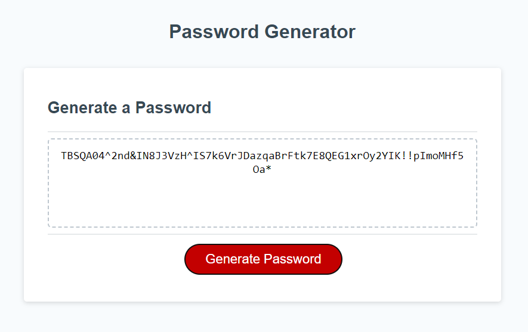

# challenge-03-password-generator
Hello! This repository contains the code I created for the third challenge:
Password Generator.
I worked mainly with Javascript to build this solution.
My comments are entirely in the Javscript file.
Here is the link to the deployed application:
https://whitspa.github.io/challenge-03-password-generator/

And here is the link to the repository:
https://github.com/whitspa/challenge-03-password-generator.git

My github repository is published under the MIT license
and I can be reached via email at: whitspa64@gmail.com
with any questions.

A screen shot of the deployed application is below

